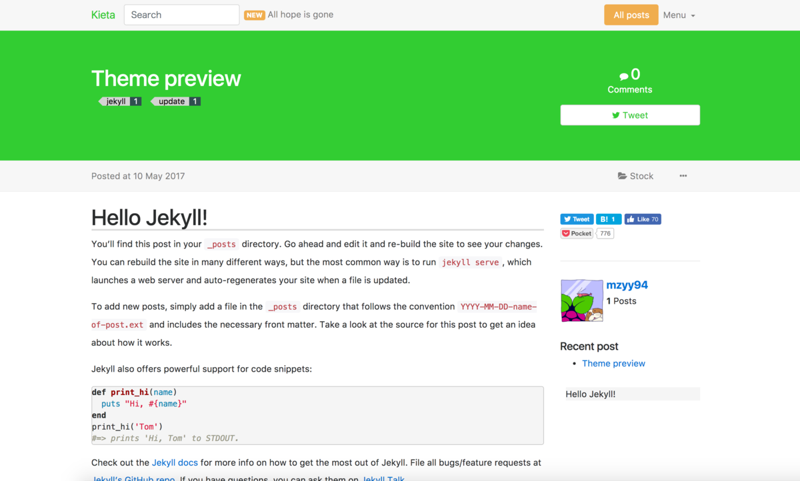

# jekyll-kieta-theme

**Clean knowledge sharing jekyll theme**


---


## Installation

Simply create `_config.yml` in your repository root, and add these lines:

```yaml
title: Kieta # What you want
subtitle: All hope is gone # Same as above
author: YOUR_NAME_OR_ID # your name.
twitter:
  username: YOUR_TWITTER_ID # your name.
disqus: YOUR_DISQUS_SHORTNAME 
color: limegreen # web color
remote_theme: mzyy94/jekyll-kieta-theme
branch: master # where your github pages hosted branch

permalink: /items/:title
search_engine: https://www.google.com/search
paginate: 5
paginate_path: "/page/:num"
jekyll-mentions: https://twitter.com
feed:
  path: /atom.xml

exclude:
  - Gemfile
  - Gemfile.lock
plugins:
  - jekyll-avatar
  - jekyll-paginate
  - jekyll-seo-tag
  - jekyll-mentions
  - jekyll-sitemap
  - jemoji
  - jekyll-feed
  # Add more you want
markdown: kramdown
kramdown:
  auto_ids:       true
  entity_output:  as_char
  toc_levels:     1..6
  smart_quotes:   lsquo,rsquo,ldquo,rdquo
  input:          GFM
  hard_wrap:      true
  footnote_nr:    1
```

## Usage

Create posts or some independed pages. See [jekyll official docs](https://jekyllrb.com/docs/home/).

## Development

To set up your environment to develop this theme, run `bundle install`.

Your theme is setup just like a normal Jekyll site! To test your theme, run `bundle exec jekyll serve` and open your browser at `http://localhost:4000`. This starts a Jekyll server using your theme. Add pages, documents, data, etc. like normal to test your theme's contents. As you make modifications to your theme and to your content, your site will regenerate and you should see the changes in the browser after a refresh, just like normal.

When your theme is released, only the files in `_layouts`, `_includes`, and `_sass` tracked with Git will be released.

## License

The theme is available as open source under the terms of the [MIT License](https://opensource.org/licenses/MIT).

